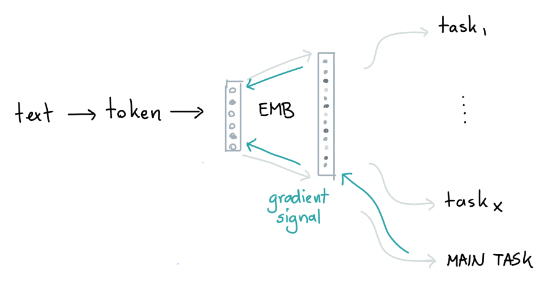

# Day 01: The Big Picture 

## How the ball got rolling.

Tools like word2vec and BERT have proven to be useful. You didn't need labelled
data because you could just use the word-order as a pattern to learn. It idea 
became very popular and it turned out to be a reasonable pre-processing technique. 

I was wondering if these systems are really training a signal that I'm interested in though. 
Both systems don't really learn the meaning of a word, they merely predict in what order
they are likely to appear. There's a proxy in there that's useful, but it's also
incredibly hard to steer since the system has no actual notion of the meaning of a word.
It's a preprocessing technique that's very easy to apply, but very hard to trust.

## An Example 

Let's show a quick demo from spaCy. 

```python
import spacy

nlp = spacy.load("en_core_web_md")  # make sure to use larger package!
doc1 = nlp("I love python.")
doc2 = nlp("I hate python.")

# Similarity of two documents
print(doc1, "<->", doc2, doc1.similarity(doc2))

# Output: 
# I love python. <-> I hate python. 0.951918946265527
```

The sentence "I love python" seems to be very similar to "I hate python". This
seems strange, but it's what you can expect from a system that's trained to predict
where words might appear in a sentence. The word "hate" and "love" might have 
an opposite meaning, but you can easily exchange them and the sentence would still
be grammatically solid. 

There's a lot of information in these pretrained embeddings, but it might not
be the information that you're interested in.

## What else can we do? 

If I were training a system to detect sentiment in a specific domain, let's say sentiment
on a particular website, then I'm more interested in a pre-trained system that has been 
trained on other sentiment tasks in the online domain. That's much better than a system that
can predict the next word on Wikipedia. 

What I'm after, I think, is a system that looks more like this: 

<figure>
  
  <figcaption>Overview of an architecture.</figcaption>
</figure>

The idea is to have a system that is able to learn on multiple tasks. Each task represents
a labelled dataset that contains a specific signal that you're interested in. By adding many of them 
you may just get a very general embedding that's able to handle tasks that are similar to the main
task that you're interested in. In the case of online sentiment, you can try to fetch other online
sentiment datasets as a proxy.

<figure>
  
  <figcaption>Multiple tasks will push the embeddings in different directions.</figcaption>
</figure>

What's especially nice about this architecture is that it should be relatively easy to, after finetuning, 
add the main task that you're interested in. It is, after all, just another task. 

<figure>
  
  <figcaption>Adding a main task, to finetune towards, after pre-training is done.</figcaption>
</figure>

## Benefits

There's a lot about this architecture diagram that I like. We seem to be very flexible in the tasks t
hat we add. We can add classification tasks, tagging tasks or even question answering tasks. To keep 
things simple though, I'll only consider architectures that embed an entire sentence that ignores word
order. That means that I won't handle entity detection tasks for now.

Another big benefit is that we're also very flexible in terms of datasets that we add. If you're 
interested in twitter analytics, you can simply only add tasks that do some sort of classification
on twitter. A big downside of using big pretrained BERT/word2vec models is that they overfit on Wikipedia-esque
datasources, which may be totally unlike your use-case. You're also able to be more selective in the 
datasets that you add. You may want to add many small datasets with labels that you trust instead of hoping
that a 3rd party cares about label quality. It's also good to point out that we're still able
to add a task that tries to predict the next word in a sequence. That would also just be another task.

Finally, another thing that I like about this approach is that we can try to keep things lightweight. 
I'll likely use keras for this project, but by keeping the embedding layers at bay as well as the tasks
I should be able to build something that can train/predict on commodity hardware.

## Open Questions 

There's plenty of open questions that I'll need to tackle though. 

1. How do you train on multiple tasks effectively? How can I make sure that we don't forget what
we learned from a batch of data from task 1 by the time that we reach task X? Can I prevent that
we overfit on tasks that have a larger dataset attached?
2. Can we do something clever with the tokeniser? It'd be nice if we can easily swap parts so that
we can rely on subword tokens so that we're robust against spelling. It'd also be grand if we could
use a trick that prevents our vocabulary from blowing up (hint: there is one).
3. If we want to keep this system lightweight we cannot use the `.fit().predict()`-API since it 
will require us to have all the data in memory. Instead, we may want to fall back to the `.fit_partial().predict()` API 
that's also commonly use in [vowpal wabbit](https://vowpalwabbit.org/) and [spaCy](https://spacy.io/).
4. What architecture decisions will make sense when we're interested in training embeddings? During the pre-training
phase we may care more about a generally useful representation than an accuracy number. But this won't be the case 
when we actually go to our fine-tunable tasks. 
5. How can we keep everything lightweight? On my end it's a hard constraint that this system
needs to be trainable on a CPU first and a GPU second. 
6. Can we really trust labels in our tasks? Generally, [the answer is no](https://koaning.io/posts/labels/). 
Instead of resorting to blind trust, it'd also be nice if we had a system that does some active learning and 
could tell us when there's some examples in a tasks that deserve double-checking. 
7. Can we prevent big grids? Grid-Search tends to be a distraction, especially [when grids get big](https://koaning.io/posts/oops-and-optimality/).
I'd love to spend less time doing grid-search and more time investigating my data. 
It'd therefore be very preferable if we came up with something that's relatively general and 
doesn't require the tuning of many parameters. It's fine if we allow customisation, but it needs to be
clear upfront what the effect of a change might be.
8. Google once made a system that does pretty much what I'm describing called the ["Universal Sentence Encoder"](https://tfhub.dev/google/universal-sentence-encoder/4). 
They released pretrained models, but they never released the system that allows you to train your own. One
could wonder, is there a good reason for this? It may be very hard to train such a system.

## Up Next

I'm pretty excited about this work. It feels both like a great idea, while also feeling
like I have [no idea what I'm doing](https://youtu.be/8pTEmbeENF4?t=1741). In a good way. This combination usually leads me to learn many things. 

I hope it will be interesting to other folks too. So I'll add a chapter whenever I reach a new 
milestone.