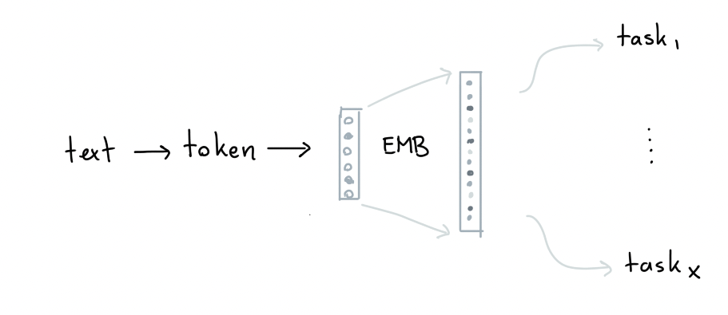
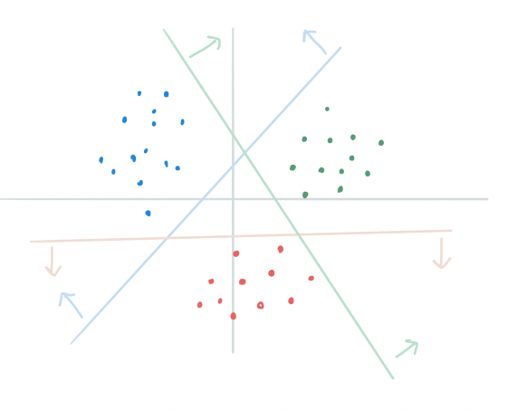
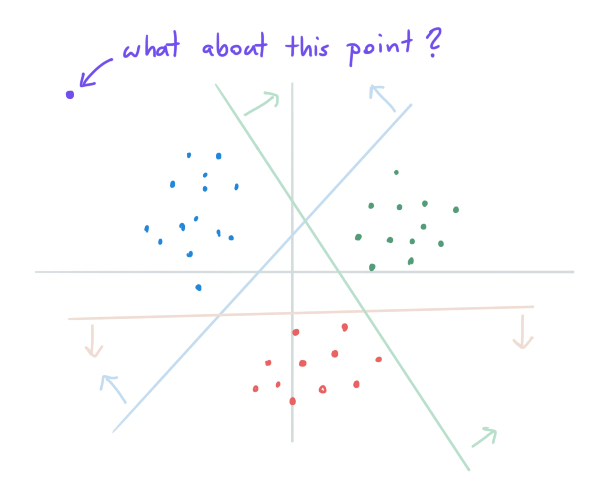
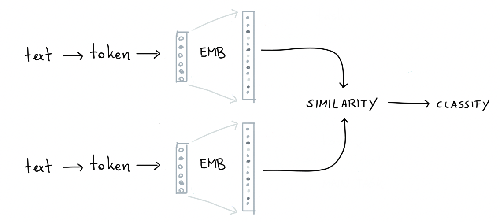

# Day 02: The Final Layer 

In this document I'd like to discuss the logic that went into designing
the final layer of my architecture. That is to say, the layer that connects
the embedding output to each task.

<figure>
  
  <figcaption>Overview of the architecture idea.</figcaption>
</figure>

## General Classification

Before explaining what I'd like to do in the final layer of my neural network
I'd like to motivate it with something that I've always found a bit strange 
in machine learning. 

Let's say that we're dealing with this classification task.

<figure>
  
  <figcaption>Simple two dimension classification task.</figcaption>
</figure>

If we were to use a logistic regression on this dataset, we may end up with
decision boundaries that look like below.

<figure>
  
  <figcaption>Simple decision boundaries. Arrows point to the label direction.</figcaption>
</figure>

These decision boundaries are not bad, but they leave us with an awkward side effect. 

<figure>
  
  <figcaption>Does the purple point belong to the blue class?</figcaption>
</figure>

If we introduce a new point that's clearly in the "blue zone" but also very clearly
outside of the "blue cluster", what would we like our embedding engine to learn? Maybe
it'd be better if we didn't use a final layer that learns labels by separating planes. 
Maybe it'd be better if we tried to associate a label with an embedding as well! 

## The StarSpace Trick 

What I'm describing here is what I like to call "the starspace trick". It's a 
trick that's described in the [StarSpace: Embed All The Things!](https://arxiv.org/abs/1709.03856)-paper
which I've seen work very well in Rasa's 
[DIET](https://arxiv.org/pdf/2004.09936.pdf) and [TED](https://arxiv.org/pdf/1910.00486.pdf) algorithms. If 
you're interested in a intuitive deep dive, you may enjoy 
[this algorith whiteboard video](https://www.youtube.com/watch?v=ZT3_9Kjx7oI&ab_channel=Rasa)
that I made on behalf of Rasa but the short story is as follows:

1. You make an embedding for the text but you also create an embedding of the same size for each of the labels. 
2. You can calculate a similarity between the text embedding and each of the label embeddings. This similarity score can be normalised so that you end up with scores for classification. 
3. What's cool about this is that your embedded space won't just contain text embeddings. It will also contain label embeddings! This adds a little bit of extra interpretability to the space.
4. What's especially cool in our case; we will embed many labels from different tasks! That allows us to varify if we see patterns that we'd expect.

So let's re-draw our architecture diagrams for different tasks. 

### Classification Tasks

<figure>
  
  <figcaption>Labels are encoded as embeddings too.</figcaption>
</figure>

The idea is to take our text embedding and to compare it against a label embedding. 
The embedding for the correct label needs to have a high similarity while the 
embeddings for the incorrect labels should all have a low similary. That's the 
pattern that our network should learn. If we get that right, we've got a classifier
that's using the StarSpace trick.

### Tagging Tasks

<figure>
  
  <figcaption>Tags can be encoded as one-off embeddings.</figcaption>
</figure>

Classification imples that there is only one correct class per text. Many tasks 
fit this scenario, but it doesn't really fit the "tagging" usecase. You could
also associate a single text with many tags. For example, a piece of text may
contain both "gratitude" and "relief" at the same time. 

To handle the "tagging" use-case we can make a small variation on the classification
use-case. We simply take each possible tag, and each tag is treated as a binary
classification problem.

### Text Comparison Tasks

<figure>
  
  <figcaption>Top might be a question, bottom could be an answer.</figcaption>
</figure>

After thinking about it, we may also use this trick to associate texts with eachother. 
If we take a question/answering dataset we can try to predict if a certain question
is answered by a certain answer. We wouldn't encode a label anymore, but we would again
be able to compare two embeddings by using "similarity" again. We can sample
examples of question/answer pairs that are not related (call these negative samples). 
The would need to have a low similarity while the actual question/answer pair should have
a high similarity.

This trick isn't limited to question/answer pairs though. We may also encode text in
a conversation between two people with this route. A positive label would indicate two
texts happen in sequence while negative labels would indicate they don't.

## Details to Figure Out 

I've explained here why I'll be building the architecture in a certain way but I 
want to acknolwedge there's lots of numeric details to get right. To keep things
simple I'll likely focus on the classification/tagging tasks first before I consider
the text comparison tasks. 
